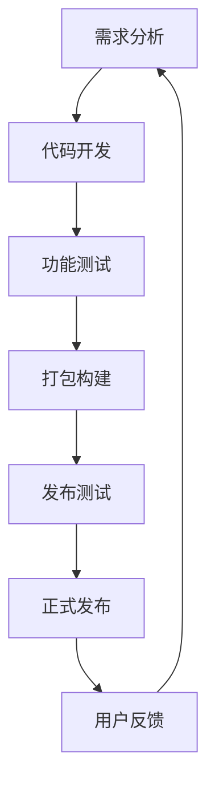

# Chrome 浏览器扩展安装器 - 文档索引

## 📚 文档目录

### 总体说明
- [README.md](README.md) - 源代码目录整体结构说明

### 详细说明文档
- [main-program.md](main-program.md) - 主程序文件详细说明
- [resources.md](resources.md) - 资源文件详细说明
- [installation-guide.md](installation-guide.md) - 安装和使用指南

## 🏗️ 架构概览

### 目录结构
```
installer-python/
├── docs/                    # 文档目录
│   ├── README.md           # 总体说明
│   ├── main-program.md     # 主程序说明
│   ├── resources.md        # 资源文件说明
│   ├── installation-guide.md # 安装指南
│   └── index.md            # 文档索引
├── icon/                   # 图标资源
│   └── multi_size.ico     # 多尺寸图标
├── output/                 # 输出目录
│   └── ec-chrome-extension-installer.exe
├── setp/                   # 安装步骤图片
│   ├── 1.png              # 步骤1图片
│   ├── 2.png              # 步骤2图片
│   ├── 3.png              # 步骤3图片
│   ├── 4.png              # 步骤4图片
│   └── 5.png              # 步骤5图片
├── main.py                 # 主程序
├── build.py               # 打包脚本
├── installer.spec         # 打包配置
└── requirements.txt       # 依赖列表
```

### 开发工作流


## 🔧 开发指南

### 快速开始
1. **环境准备**
   ```bash
   # 安装 Python 3.7+
   # 安装依赖包
   pip install -r requirements.txt
   ```

2. **开发测试**
   ```bash
   # 运行安装器进行测试
   python main.py
   ```

3. **打包发布**
   ```bash
   # 打包为可执行文件
   python build.py
   ```

### 代码规范
- 遵循 PEP 8 Python 编码规范
- 使用有意义的变量和函数名
- 添加必要的注释和文档字符串
- 进行单元测试和集成测试

### 版本管理
- 使用语义化版本号（Semantic Versioning）
- 每次发布更新变更日志
- 维护兼容性说明文档

## 📖 文档维护

### 文档结构
- **README.md**：项目总体介绍和快速开始
- **main-program.md**：核心代码的详细说明
- **resources.md**：资源文件的管理和使用
- **installation-guide.md**：用户安装和使用指南
- **index.md**：文档导航和索引

### 更新流程
1. 代码变更时同步更新相关文档
2. 新增功能时创建对应的文档
3. 定期审查文档的准确性和完整性
4. 根据用户反馈优化文档内容

### 贡献指南
欢迎为文档做出贡献：
- 修正文档中的错误和过时信息
- 补充缺失的功能说明
- 优化文档的结构和可读性
- 翻译为其他语言版本

## 🔗 相关资源

### 项目资源
- **源代码**：项目根目录的 src/ 目录
- **构建配置**：vite.config.ts 文件
- **扩展配置**：src/manifest.json 文件
- **项目文档**：项目根目录的 README.md

### 外部资源
- **Python 官方文档**：https://docs.python.org/
- **Tkinter 文档**：https://docs.python.org/3/library/tkinter.html
- **PyInstaller 文档**：https://pyinstaller.org/
- **Pillow 文档**：https://pillow.readthedocs.io/

## 📞 技术支持

### 获取帮助
- **文档查询**：首先查阅本文档和相关文档
- **社区支持**：在项目社区中提问和讨论
- **问题报告**：通过 Issue 系统报告 Bug

### 联系方式
- **项目维护者**：联系项目负责人
- **开发团队**：通过项目渠道联系
- **用户反馈**：提供使用体验和改进建议

### 问题分类
- **安装问题**：参考 installation-guide.md
- **开发问题**：参考 main-program.md
- **资源问题**：参考 resources.md
- **使用问题**：参考项目总体文档

## 🎯 使用场景

### 最终用户
- 下载安装器程序进行安装
- 按照安装指南完成配置
- 使用扩展功能进行 VNC 连接管理

### 开发者
- 了解项目架构和代码结构
- 进行二次开发和功能扩展
- 参与项目维护和优化

### 测试人员
- 验证安装流程的完整性
- 测试不同环境下的兼容性
- 提供用户体验反馈

## 🔄 更新日志

### 文档版本
- **v1.0**（2026-01-13）：初始版本，包含完整的文档结构

### 计划更新
- 添加更多代码示例和最佳实践
- 完善故障排除和调试指南
- 提供多语言版本支持
- 添加视频教程和截图示例

---

*文档维护：Context7-代码助手*  
*最后更新：2026年1月13日*  
*版本：v1.0*