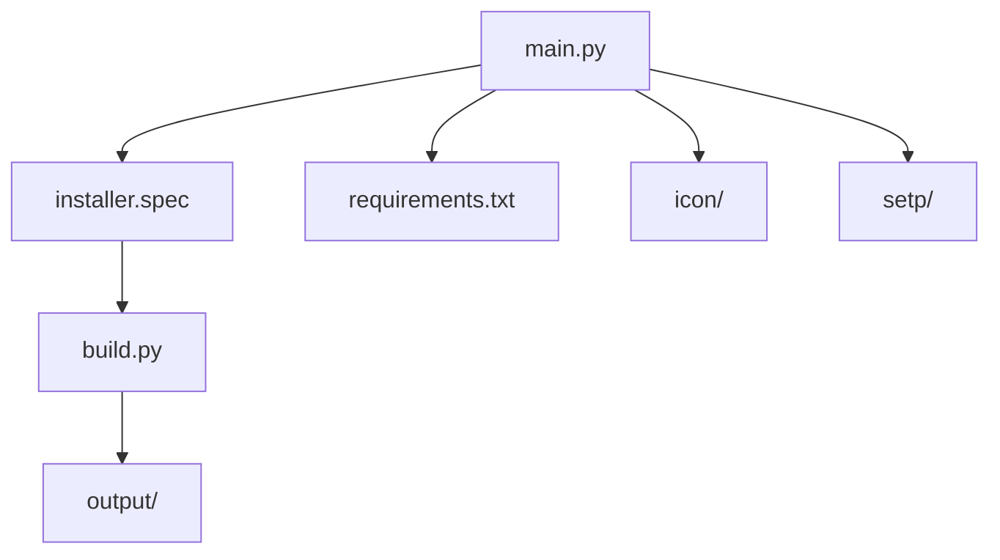

# 主程序文件说明

## 文件概述

本文档详细说明 `installer-python` 目录下核心程序文件的功能和作用。

## 核心文件说明

### 🖥️ main.py
**安装器主程序**

**功能描述：**
- 安装器的图形用户界面程序
- 实现完整的安装向导流程
- 处理用户交互和安装逻辑

**主要功能模块：**

#### 1. 界面初始化
```python
def __init__(self):
    # 创建主窗口
    self.root = tk.Tk()
    self.root.title("Chrome Browser Extension Installer")
    self.root.geometry("800x600")
    
    # 设置窗口图标
    self.set_window_icon()
    
    # 初始化安装路径
    self.install_path = r"C:\ec-chrome-extension"
    self.is_update = self.check_update()
    self.current_step = 0
```

#### 2. 安装步骤管理
- **步骤1**：欢迎界面和许可协议
- **步骤2**：安装路径选择
- **步骤3**：浏览器检测和配置
- **步骤4**：文件复制和安装
- **步骤5**：安装完成确认

#### 3. 浏览器检测功能
```python
def detect_chrome(self):
    """检测 Chrome 浏览器安装情况"""
    # 检查注册表中的浏览器路径
    # 返回浏览器版本和安装路径
```

#### 4. 文件操作功能
```python
def copy_extension_files(self):
    """复制扩展文件到目标目录"""
    # 创建安装目录
    # 复制扩展文件
    # 设置文件权限
```

#### 5. 注册表配置
```python
def setup_registry(self):
    """配置浏览器扩展注册表"""
    # 写入扩展配置信息
    # 设置浏览器启动参数
```

**关键特性：**
- 支持静默安装模式
- 提供安装进度显示
- 包含完整的错误处理
- 支持安装回滚功能

### 🔨 build.py
**打包脚本**

**功能描述：**
- 将 Python 安装器程序打包为 Windows exe 文件
- 自动化打包流程和依赖管理
- 生成独立的可执行安装程序

**主要功能：**

#### 1. 环境检查
```python
def check_pyinstaller():
    """检查 PyInstaller 是否已安装"""
    try:
        import PyInstaller
        return True
    except ImportError:
        return False
```

#### 2. 依赖安装
```python
def install_pyinstaller():
    """安装 PyInstaller"""
    subprocess.check_call([sys.executable, "-m", "pip", "install", "pyinstaller"])
```

#### 3. 打包执行
```python
def build_installer():
    """执行打包操作"""
    # 清理旧的输出文件
    # 执行 PyInstaller 打包命令
    # 验证生成的可执行文件
```

**打包配置：**
- 包含所有必要的依赖库
- 设置程序图标和版本信息
- 优化文件大小和启动速度
- 支持 Windows 系统要求

### 📋 installer.spec
**PyInstaller 配置文件**

**功能描述：**
- 定义 PyInstaller 打包的详细配置
- 控制打包过程中的各种参数
- 确保生成的可执行文件功能完整

**配置内容：**

#### 1. 程序信息
```python
# 程序名称和版本
name = 'ec-chrome-extension-installer'
version = '1.0.0'
```

#### 2. 文件包含
```python
# 包含的数据文件
datas = [
    ('icon/multi_size.ico', 'icon'),
    ('setp/*.png', 'setp')
]
```

#### 3. 隐藏导入
```python
# 需要手动包含的隐藏模块
hiddenimports = [
    'tkinter',
    'PIL',
    'winreg'
]
```

#### 4. 打包选项
```python
# 打包优化选项
options = {
    'optimize': 2,
    'bundle_files': 1,
    'compressed': True
}
```

### 📦 requirements.txt
**依赖包列表**

**功能描述：**
- 定义安装器程序所需的 Python 包
- 确保开发环境和打包环境的一致性

**包含的依赖：**
- **PyInstaller** - 程序打包工具
- **Pillow** - 图像处理库（用于图标和图片）
- **其他系统库** - Windows API 相关功能

**安装命令：**
```bash
pip install -r requirements.txt
```

## 文件依赖关系



## 开发注意事项

### 代码修改规范
1. **main.py**：修改界面逻辑或安装流程
2. **build.py**：调整打包配置或依赖管理
3. **installer.spec**：修改打包参数或文件包含
4. **requirements.txt**：添加或更新依赖包

### 测试流程
1. 开发环境测试 Python 脚本功能
2. 打包后测试 exe 文件安装流程
3. 在不同 Windows 版本上测试兼容性
4. 测试错误处理和异常情况

### 性能优化
1. 减少不必要的文件复制操作
2. 优化界面加载和响应速度
3. 压缩图片资源减少文件大小
4. 合理使用缓存和延迟加载

## 扩展建议

### 功能增强
1. **多语言支持**：添加国际化界面
2. **自定义主题**：支持界面主题切换
3. **安装统计**：收集安装数据用于分析
4. **自动更新**：添加程序自动更新功能

### 技术改进
1. **异步处理**：使用多线程处理耗时操作
2. **日志系统**：添加详细的安装日志记录
3. **配置管理**：支持用户自定义配置
4. **安全加固**：增强安装过程的安全性