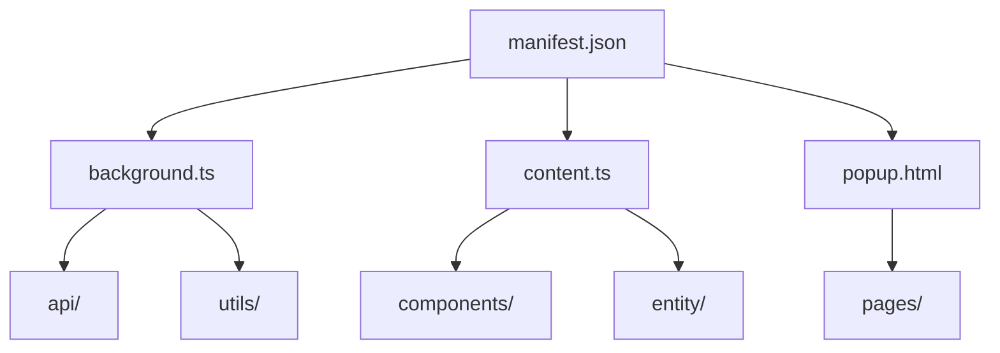

# 重要文件说明

## 文件概述

本文档详细说明 `src` 根目录下重要文件的功能和作用。

## 核心文件说明

### 🔄 background.ts
**后台脚本**

**功能描述：**
- 浏览器扩展的后台运行脚本
- 处理跨域请求和消息通信
- 管理 VNC 连接和原生消息传递

**主要功能：**
1. **跨域请求处理**
   - 接收来自内容脚本的 API 请求
   - 使用 Fetch API 发送跨域请求
   - 返回处理结果给内容脚本

2. **VNC 连接管理**
   - 生成 VNC 连接配置文件（.svn）
   - 通过原生消息传递调用 RealVNC
   - 处理连接状态和错误信息

3. **扩展生命周期管理**
   - 处理扩展安装和更新事件
   - 管理后台服务状态
   - 提供持久化存储支持

**关键代码片段：**
```typescript
// 处理跨域请求
browser.runtime.onMessage.addListener((request, sender, sendResponse) => {
  if (request.type === 'apiRequest') {
    // 处理 API 请求逻辑
  } else if (request.type === 'vncConnect') {
    // 处理 VNC 连接请求
  }
});
```

### 🌍 content.ts
**内容脚本**

**功能描述：**
- 在网页中注入 Vue 应用程序
- 提供与网页的交互能力
- 管理扩展界面在网页中的显示

**主要功能：**
1. **Vue 应用注入**
   - 创建容器元素挂载 Vue 应用
   - 管理应用生命周期
   - 处理与网页的样式冲突

2. **事件处理**
   - 监听页面事件和用户交互
   - 提供回调函数注册机制
   - 处理组件焦点和状态变化

3. **通信桥梁**
   - 与后台脚本进行消息通信
   - 转发用户操作到后台处理
   - 接收后台处理结果并更新界面

**关键代码片段：**
```typescript
// 创建 Vue 应用容器
const appContainer = document.createElement('div');
appContainer.id = 'cpu-test-extension-container';

// 挂载 Vue 应用
const appInstance = createApp(Main).mount(appContainer);
```

### 📋 manifest.json
**扩展配置文件**

**功能描述：**
- 定义浏览器扩展的基本信息和权限
- 配置扩展的各个组件和功能
- 声明扩展所需的 API 和资源

**配置内容：**
1. **基本信息**
   - 扩展名称、版本、描述
   - 图标和主题颜色
   - 作者和主页信息

2. **权限声明**
   - 跨域请求权限
   - 原生消息传递权限
   - 存储和标签页权限

3. **组件配置**
   - 后台脚本配置
   - 内容脚本配置
   - 弹出页面配置

### 🪟 popup.html / popup.ts
**弹出窗口文件**

**功能描述：**
- 定义浏览器工具栏弹出窗口的界面
- 提供快捷操作和状态显示
- 支持用户交互和设置调整

**文件分工：**
- **popup.html** - HTML 模板文件，定义页面结构
- **popup.ts** - TypeScript 逻辑文件，处理页面交互

**主要功能：**
- 显示扩展基本信息
- 提供快捷连接功能
- 支持设置和配置调整
- 显示实时状态和通知

### 📊 vite-env.d.ts
**TypeScript 环境类型定义**

**功能描述：**
- 提供 Vite 和浏览器扩展相关的类型定义
- 确保 TypeScript 类型检查的完整性
- 声明第三方库的类型信息

**包含内容：**
- Vite 构建工具的类型定义
- 浏览器扩展 API 的类型声明
- 自定义模块的类型补充
- 全局变量和环境的类型定义

## 文件依赖关系



## 开发注意事项

### 文件修改规范
1. **manifest.json**：修改后需要重新加载扩展
2. **background.ts**：修改后扩展会自动重启
3. **content.ts**：修改后需要刷新页面生效
4. **popup 文件**：修改后立即生效

### 调试技巧
1. 使用浏览器开发者工具调试后台脚本
2. 在内容脚本中添加 console.log 进行调试
3. 使用扩展的调试页面查看运行状态
4. 检查浏览器控制台查看错误信息

### 性能优化
1. 后台脚本尽量减少内存占用
2. 内容脚本避免阻塞页面渲染
3. 弹出窗口保持轻量级设计
4. 合理使用缓存和延迟加载

## 扩展建议

1. **新功能添加**：根据功能需求在相应文件中添加代码
2. **代码重构**：定期审查代码结构，优化文件组织
3. **文档更新**：修改重要文件时同步更新本文档
4. **测试覆盖**：为核心文件添加完整的单元测试